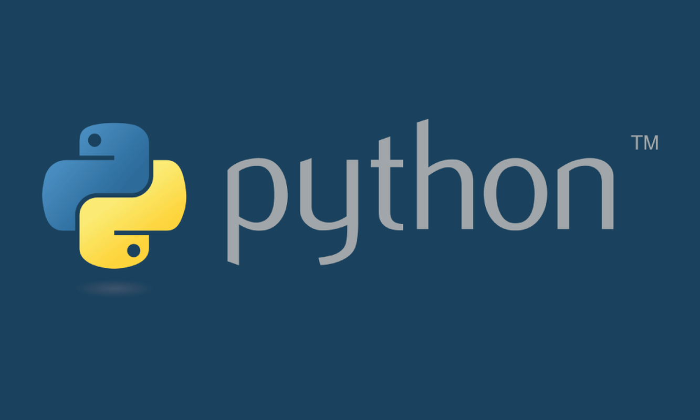
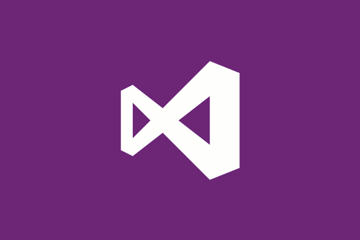

## Hi there 👋 Soy Rubén

### Os cuento un poco...
Sobre mí tan solo deciros que soy nuevo en este mundo pero tengo muchismas ganas de ir creciendo en el día a día.

### Lenguajes e IDEs

         
  

### Analytic

Aprendizaje continuo

### Curiosidades

🔭 Estoy de excedencia en una empresa de Automoción.
  
🌱 Aunque vivo en La Rioja cerca de Álava yo soy de Asturias.
  
👯 Veo fundamental el trabajo colaborativo.
  
🤔 Me encanta aprender e ir inovandoe en mi crecimiento laboral.

💬 Habalamos + 343 22 2 23 23 23

📫 Prefieres escribir: rlb09@hotmail.es

____

Página experimental
 by <b>Rubén López
 

-----
